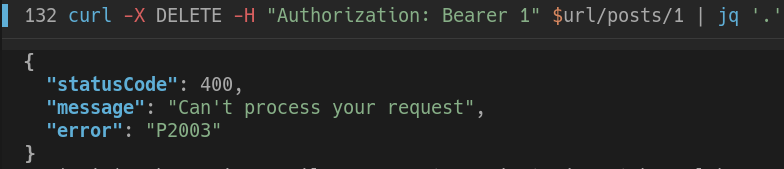

# Тестування працездатності системи

Для тестування системи використовувався `curl`

Був реалізований доступ до таблиць: **User**, **Access**, **Post** - із примітивним доступом за ролями

#### Nest Startup Log

    

## Початкове наповнення бази даних

    

## User

### Get (All)

    

### Post

    

### Get/Id

    
    

###  Patch

    

###  Delete

    
    

## Access

### Get (All)

    
    

### Post

    

### Get/Id

    

###  Patch

    

###  Delete

    

## Post

### Get (All)

    

### Post

    

### Get/Id

    

Access is automatically added on post request

  

### Patch

    
    

### Delete

    We have added constraints to the table, so we can not delete it  

    

